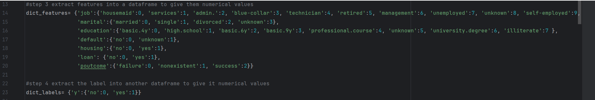
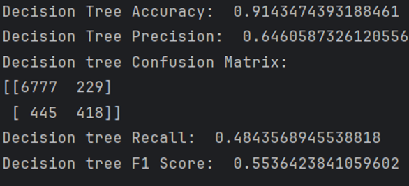
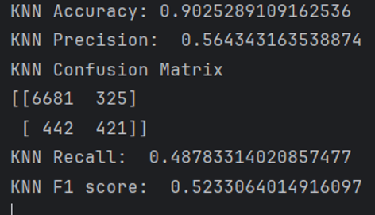
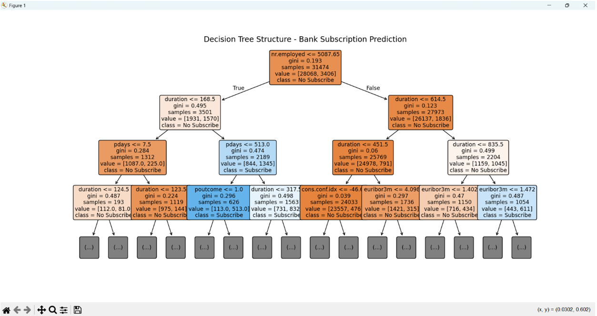
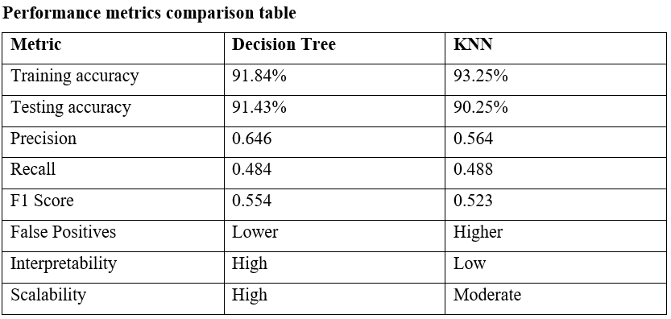

# Bank Client Subscription Behaviour Analysis — Machine Learning Project

## Project Overview
This project focuses on predicting whether a bank client will subscribe to a term deposit or not using machine learning techniques. The project was developed using Python and scikit-learn and applies classification models to analyse customer and campaign-related data.

## Dataset
The project uses the Bank Marketing dataset from kaggle, which includes features such as age, job, marital status, education, balance, housing loan, personal loan, contact type, campaign details, and the target variable indicating whether the client subscribed to a term deposit.

## What Was Built
- Data preprocessing and cleaning
- Encoding of categorical variables
- Train-test split for model evaluation
- Implementation of Decision Tree and K-Nearest Neighbours (KNN)
- Performance comparison using accuracy, precision, recall, F1-score, and confusion matrix
- Model evaluation and interpretation
- Visualisation of the decision tree structure

## Tools Used
- Python
- Pandas
- NumPy
- Scikit-learn
- Matplotlib

## Files
- `bank_subscription_prediction.py` — Python code for Decision Tree and KNN models

## Screenshots
### Preprocessing / Encoding

### Decision Tree Results

### KNN Results

### Decision Tree Visualization

### Performance Metrics Comparison

## How to Run
1. Open the notebook or Python file in Jupyter Notebook or any Python environment.
2. Install the required libraries.
3. Load the dataset.
4. Run the preprocessing, training, and evaluation steps.
5. Review the model outputs and visualisations.
